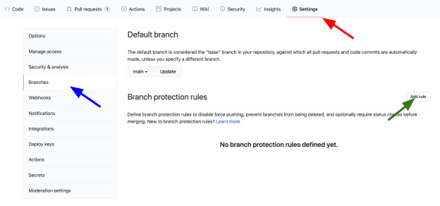

# Setting up CI/CD with Github Actions

### Continuous integration and continuous deployment are must-haves for organizations that wish to scale and deliver high quality software at a high velocity. This article walks you through the process of using github actions to build CI/CD flows.

1. [What is CI/CD?]()
2. [Adding a github workflow to your project]()
3. [Building a CI workflow with Github actions]()
4. [Building a CD workflow with Github actions]()
5. [Optimizing the workflow]()


## Adding a github workflow to a project

Create a .github/workflows folder. We'll be adding our github actions within this folder. The actions are set in yaml files in a fairly straightforward structure that consists of three parts: 

**name**: the name of the workflow, in our case `Test and Build`
**on**: the trigger that starts the workflow when conditions are satisfied. In our case, we want the workflow to run when a pull request is created and pushed. We'll see examples of other triggers later in the tutorial. 
**jobs**: the actual commands that run in the flow. These can be multiple jobs that run in parallel or jobs that are dependent on one another. In this example there is one job called `build-test`that runs only on ubuntu-latest OS. 


```yaml
name: Test and Build
on:
 pull_request:
   branches:
     - main
jobs:
 build-test:
   runs-on: ubuntu-latest
   steps:
     - name: Checkout
       uses: actions/checkout@v2
       with:
         fetch-depth: 0
     - name: Setup NodeJS 14
       uses: actions/setup-node@v1
       with:
         node-version: 14
     - name: Install yarn
       run: npm install -g yarn
     - name: Install dependencies
       run: yarn install
     - name: Test
       run: yarn test
```

The first step checks out the repository, using a pre-made action `actions/checkout@v2` from the actions marketplace. We pass the `fetch-depth: 0` variable using the **with** property, which tells the checkout process will fetch the repository with its entire history. 
The following steps are for installations and running bash commands. 

## Building a continuous integration workflow 

1. Trigger the flow with a Pull Request 
2. Launch the machine 
3. Install nodeJs on the machine 
4. Checkout the repository
5. Install dependencies 
6. Test, Lint, Build 
7. Show the results in the PR page 

### Getting Started 

- If you haven't yet forked and cloned the repository, do that now and create a branch "add-ci". 
- Create a file `.github/workflows/ci.yml` and copy the contents of [this file](https://github.com/YonatanKra/company-repo/blob/97b26f01583ff3442bc9f4491383f84ab8ce37f9/.github/workflows/ci.yml) to the new file. 
- Commit the changes and push to the new branch. Open a pull request from the new branch to the main branch. 

If you look at the pull request on github, you should see the tests running: 


You'll notice that github already knows the name of the workflow, the name of the job, and the trigger. Once completed, it should look like this:


Can you spot a problem in the process? 

### Adding merge rules 

The first issue is that the **Merge pull request** button was already available during the CI process, when we only want the merge to be available if all of the required workflows have completed.

We can fix this in the repo settings by going to: Settings>Branches>Add Rule 



Here we'll select **Require status checks to pass before merging** and check everything underneath it. You'll see all workflows that are required to enable merge - in our case we only have `build-test`. 


Under **Branch name pattern** add *main* and create the rule. And if you go back to the pull request page, you'll see that no pull requests can be merged before the tests pass, unless of course you have admin privileges. 


### Merging after code review 

Before moving on, we also need to decide how to handle passing Pull Requests. There are three main approaches: 
1. Allow anyone to merge once tests have passed
2. Automatically merge once tests have passed
3. Require a code review in order to merge 

We'll go with the first option, which is the most common, which we can change by editing the branch rule we just created. At the top of the list check **Require pull request reviews before merge** and hit save. 

That it for continuous integration! Now all new Pull Requests will be tested and reviewed before they are merged into main! Next step is deployment. 

## Building a continuous deployment workflow                          
